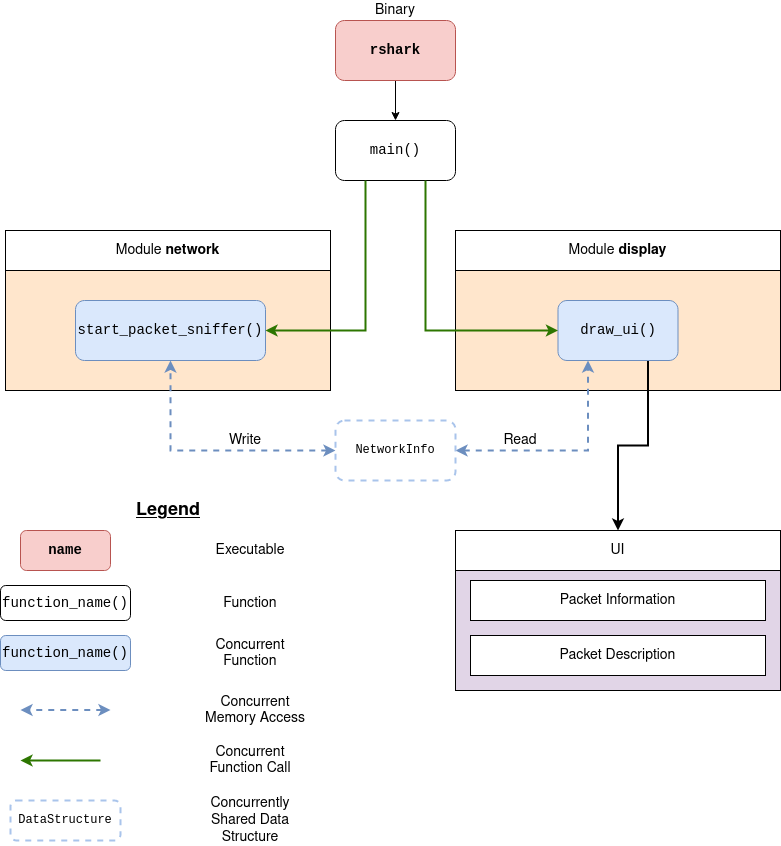

# Project Architecture

## Brief Overview

## Legend Description

* **Executable:** The binary generated from the source code.
* **Function:** Same old function that we all know.
* **Concurrent Function:** A plain function that runs concurrently on a separate thread.
* **Concurrent Memory Access:** Accessing a shared data structure concurrently.
* **Concurrent Function Call:** Calling a function on a separate thread.
* **Concurrently Shared Data Structure:** A thread-safe data structure that is accessed by multiple threads.
