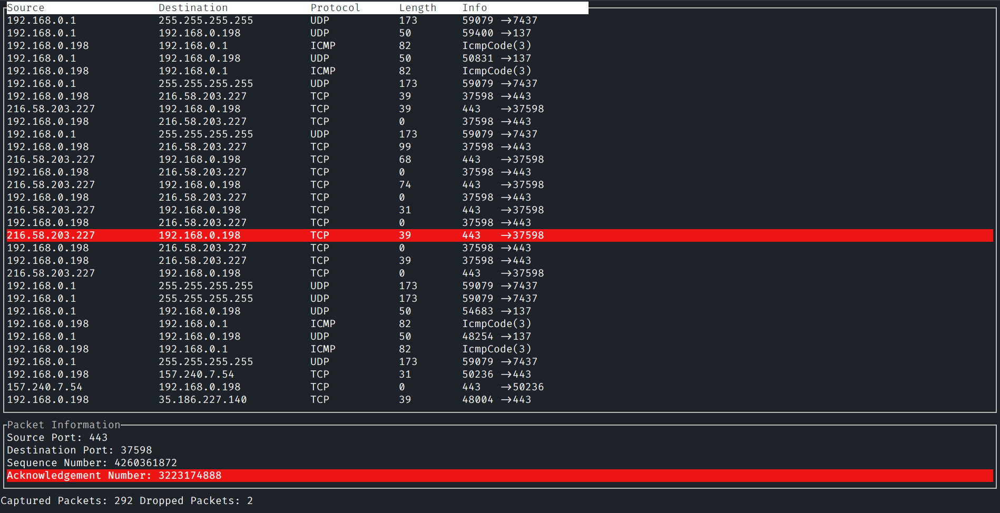

# Rshark


A terminal UI based packet monitoring tool written in Rust.



## Installation

## Usage

```output
USAGE:
    rshark [OPTIONS]

FLAGS:
    -h, --help       Prints help information
    -V, --version    Prints version information

OPTIONS:
    -i, --interface <INTERFACE>    Sets network interface to capture packets on
```

**Note that since `rshark` sniffs network packets, it requires root privileges**

## Support

Please open an issue and we'll try to help.

## Roadmap

## Contributing

Please check out the contribution guide [here](CONTRIBUTING.md).

## Authors and Acknowledgement

This project is running thanks to all the contributors.

## License

Apache License 2.0
